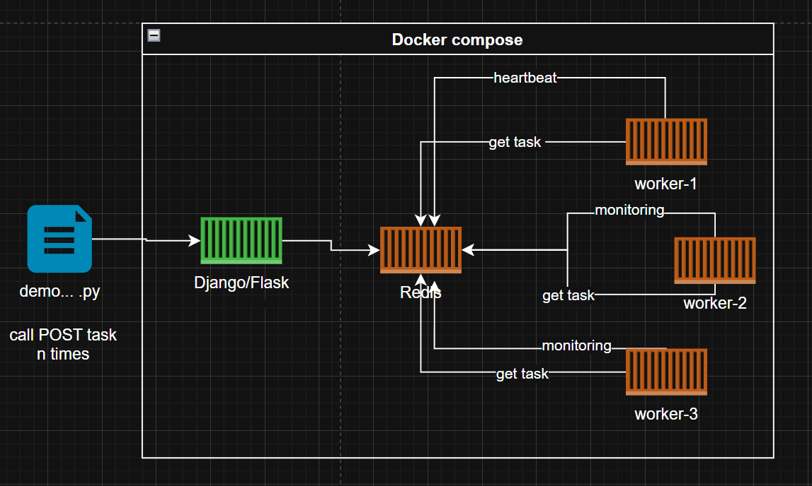

# Project 2

Revisa el contenido WIP session 6.

Extiende el projecto agregando una API Django o Flask de intermediario HTTP rest <=> Redis.

Adjunta codigo fuente e IMAGENES sobre la configuracion completa del compose corriendo. 

Captura una imagen de los logs de algun worker trabajando y de la API django enviando las tareas hacia Redis.